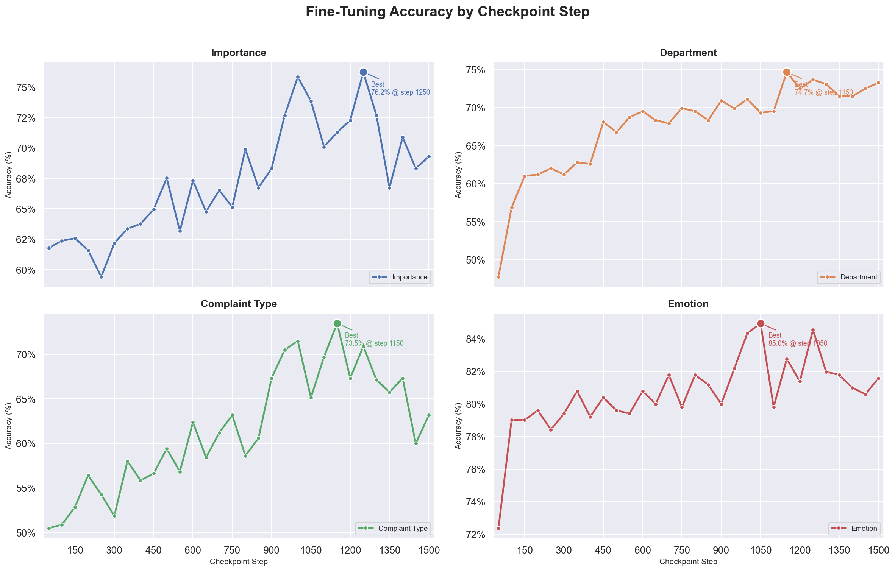
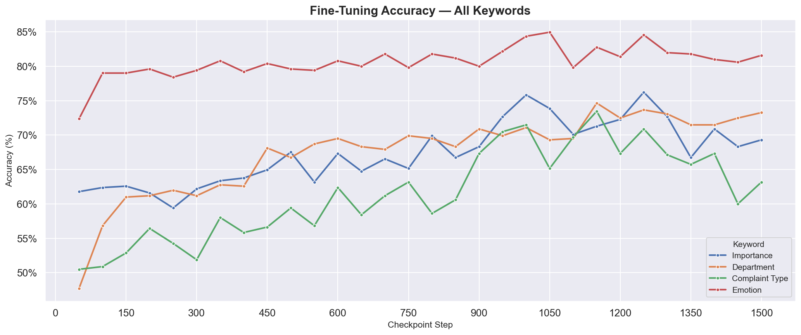

# Dataset


RAW Data Link : https://huggingface.co/datasets/leejunho12316/seoul-mayor-hope <br>
Labeled Data Link : https://huggingface.co/datasets/leejunho12316/seoul-mayor-hope-labeled-backup2500


huggingface 데이터셋 README 도 작성

## 1. Raw Data
서울시 응답소 민원 Q&A 데이터셋
**서울시 응답소 - 시장에게 알린다**
https://eungdapso.seoul.go.kr/req/mayor_hope/mayor_hope.do

서울시 응답소 공식 홈페이지에 공개된 민원 데이터를 Web Crawling하여 수집.
시민이 서울시장에게 직접 민원·건의 사항을 올리면, 서울시가 답변하는 Q&A 형태의 공개 데이터.


- 데이터셋 구조

| 컬럼명            | 설명              |
|----------------|-----------------|
| `title`        | 민원 제목           |
| `Date`         | 민원 접수 날짜        |
| `Question`     | 시민이 작성한 민원 내용   |
| `Answer`       | 서울시 답변 내용       |
| `rceptNo_enc`  | 암호화된 민원 고유 접수번호 |


- 데이터셋 정제

13,540행 -> 13,184행

원본 대비 **356건**의 이상 데이터(결측값, 중복, 특정 유형 등)를 제거.

- 결측값(NaN) 제거: `Question` 또는 `Answer`가 비어있는 행 삭제.
- 중복 데이터 제거: `Question` 중복 행 삭제 -> 도배글, 어그로성 글, 중복 비난글 다수.
- 기타 데이터 제거 : 첨부된 이미지나 파일이 있지만 서버/홈페이지의 문제로 유실되고 내용을 알 수 없는 데이터. 기다 다른 목적으로 입력한 데이터. 길이가 비정상적으로 짧은 데이터 등.

## 2. Labeled Data

민원을 분석해 LLM이 최종적으로 출력해야 할 label을 생성.
실제 현장이라면 공무원의 도움을 받아 직접 분류했을 작업을 LLM을 사용해 진행.

### System Prompt
RAGAS Prompt를 응용하여 importance, department, complaint_type, emotion 4가지의 키워드를 도출하도록 System Prompt 작성. 

| # | 키워드 | 설명 |
|---|--------|------|
| 1 | `importance` | 민원의 중요도를 구분하는 label. 민원이 빠르게 처리되어 도움을 받아야 하면 높음, 일반적인 의견 전달이라면 보통, 감정적이고 비난을 담은 글이라면 낮음. |
| 2 | `department` | 해당 민원이 전달되어야 하는 부서를 판별하는 label. 서울시 조직도를 참고하여 부서 별 맡은 역할을 요약해 작성. ([서울특별시 조직도](https://org.seoul.go.kr/mobile/org/orgChart.do)) |
| 3 | `complaint_type` | 민원의 유형을 구분하는 label. 신고, 문의, 건의, 항의, 칭찬 그리고 그 외로 분류. |
| 4 | `emotion` | 민원인의 감정상태를 구분하는 label. 긍정, 중립, 부정으로 분류. |

**with_structured_output** <br>
BaseModel을 상속받는 사용자 정의 데이터형식 클래스와 with_structured_output을 사용하여 JSON 형식으로 일관된 출력 제한.


```
SYSTEM_PROMPT = """당신은 서울시 민원 분류 담당관입니다. 지금부터 민원과 민원에 대한 답변을 읽고 키워드를 추출해주세요.
민원은 제목인 Title과 본문인 Question으로 구분되어 입력됩니다.
민원에 대한 답변은 Answer로 입력됩니다.

1. importance
Title과 Question을 보고 해당 민원의 중요도를 파악해 높음, 보통, 낮음 중 레이블을 구분하세요.
- 높음 : 행정적 조치, 전문적인 도움이 필요한 글. 특정한 문제가 발생했거나 부당한 처우에 대한 항의.
- 보통 : 보통의 의견이나 제안, 생각을 담은 글. 소식, 칭찬, 정보를 담은 글 등.
- 낮음 : 감정적으로만 작성한 글. 어그로성 글. 특정 개인에 대한 근거 없고 맹목적인 비난 글. 비논리적이고 문맥에 일관성이 없는 글. 작성이 온전히 다 되지 않은 글. 등

2. department
다음은 서울시의 각 부서가 담당하는 분야입니다. 민원 내용을 보고 해당 민원이 전달되어야 할 부서를 골라주세요.

- 교통실 : 버스·지하철·택시, 대중교통 정책, 자전거·킥보드·보행, 주차, 신호, 불법주정차, 한강버스, 교통카드, 도로교통, 자율주행
- 복지실 : 기초생활보장, 저소득층 지원, 노숙인, 어르신 돌봄, 장애인 지원, 아동·청소년 복지, 한부모·다문화가족, 중장년 지원
- 경제실 : 창업·스타트업, 소상공인·전통시장 지원, 청년 취업·일자리, 중소기업 자금, 소비자 권익, 생활임금·노동정책, 자영업자, 지원금
- 기후환경본부 : 쓰레기·재활용, 소각장, 미세먼지·대기질, 동물보호, 탄소중립·신재생에너지, 친환경차·전기차 충전, 도시공원, 식품안전
- 문화본부 : 도서관, 박물관·문화시설, 공연·예술 지원, 문화유산, 전통문화, 관광 계획, 공원 시설 관리/조성
- 시민건강국 : 보건소, 응급의료, 감염병·방역, 정신건강, 예방접종, 치매 예방, 공중위생, 건강증진, 마약 대응, 금연 지원, 금연구역 관리
- 재난안전실 : 재난대응, 취약시설 점검, 도로·보도 안전, 대피소, 시민안전보험, 제설, 인파 안전관리, 도로공사 안전 관리, 공사현장 관리
- 주택실 : 재개발·재건축, 공공주택, 전세사기, 건축인허가, 도시계획, 주거환경개선, 도시재생, 시설물 관리, 공공시설 관리, 부동산, 사유지
- 여성가족실 : 보육·어린이집, 저출생 대응, 아동학대 예방, 청소년 지원·보호, 성폭력·성희롱 예방, 디지털성범죄, 여성 안전, 양성평등
- 분류 보류 : 정부 부서 관할 이외의 기관에 대한 내용. 정치적인 내용.

단, Answer를 제외한 민원(Title과 Question)을 보았을 때 다음의 경우에 해당한다면 '분류 보류'를 설정하세요.
- Title과 Question만으로 민원의 주제를 알 수 없어 특정 부서를 분류할 수 없는 경우
- 첨부 파일을 업로드 했다고 되어 있으나 Title과 Question만으로 어떤 내용인지 유추할 수 없는 경우.
- Title과 Question이 내용을 알 수 없을 정도로 짧은 경우.

3. complaint_type
Title과 Question을 보고 민원의 유형을 다음 중 하나로 구분하세요
- 신고 : 불법 행위, 위험 상황, 규정 위반 등 제3자나 시설에 대한 문제를 알리는 경우
- 문의 : 제도, 정책, 절차, 방법 등에 대한 정보나 안내를 요청하는 경우
- 건의 : 정책 개선, 시설 설치, 제도 변경 등을 제안하는 경우
- 항의 : 행정 처리나 처우에 대한 불만을 표출하거나 시정을 요구하는 경우
- 칭찬 : 공무원, 서비스, 정책 등에 대한 긍정적인 평가를 담은 경우.
- 그 외 : 위 유형 중 어느 것으로도 분류되지 않는 경우.

4. emotion
Title과 Question을 보고 민원인의 감정상태를 긍정, 중립, 부정 중 하나로 구분하세요.

"""

```


### 비용 & 정확도 측정

label 생성 시 사용할 LLM 선정을 위해 비용과 정확도를 측정.

비용과 label 정확도를 고려하여 label 하기 위해 비용과 label 정확도를 각각 실험.
[2.ModelSelection](./2.ModelSelection)에 각 모델별 테스트용 label 생성 데이터, 정답 데이터 있음.

<br>

1. 비용 : 50건의 데이터 labeling 후 처리 가격과 특이사항 분석<br>

| 모델명                      | 50건 처리 가격 (달러) | 특이사항                                       |
  |--------------------------|---------------|--------------------------------------------|
  | gpt-4o-mini              |  <0.01 (10원 미만) | 비용 최저                                      |
  | gpt-4o                   | 0.27 (400원)  | TPM 자주 걸려 ERROR 다수 발생                      |
  | claude-sonnet-4-20250514 | 0.6 (890원)     | 레거시 모델. 같은 가격에 훨씬 높은 성능을 가진 sonnet 4.6이 있음 |
  | claude-sonnet-4-6        | 0.6 (890원)     | 처리 5분 넘게 걸림                                |
  | claude-haiku-4-5-20251001 | 0.2 (300원)     | 없음                                         |
  | gemini-3-flash-preview  | (354원)         | 처리 5분 넘게 걸림.                               |

<br>

2. 정확도 : 수동으로 50건의 민원에 대한 정답 데이터셋 생성 후 모델 별 키워드 별 정답률 도출.


| 모델 | 중요도 | 전달부서 | 민원유형 | 감정상태 |
|------|--------|----------|----------|----------|
| claude-haiku-4-5-20251001 | ➖ 38 | ✅ 42 | ✅ 39 | ➖ 38 |
| claude-sonnet-4-20250514 | ✅ 39 | ➖ 37 | ✅ 38 | ➖ 38 |
| claude-sonnet-4-6 | ✅ 40 | ❌ 34 | ➖ 37 | ✅ 42 |
| gemini-3-flash-preview | ❌ 25 | ❌ 36 | ➖ 37 | ✅ 41 |
| gpt-4o-mini | ❌ 27 | ➖ 40 | ➖ 37 | ➖ 38 |
| gpt-4o | ➖ 36 | ✅ 41 | ❌ 34 | ✅ 41 |
✅ : 준수 (상위 2등) <br>
➖ : 보통 <br>
❌ : 아쉬움 (하위 2등) <br>
-> 가장 중요한 label인 전달부서를 잘 분류하면서 '준수'항목이 2개 이상, 비용 효율적인 **claude-haiku-4-5-20251001**로 결정


예산 10,000원인 관계로 현재는 2500개 label 데이터 제작해 사용.

<br><br><br>

---

<br><br><br>

# Fine Tuning

## 과정
Runpod 사용 A40, 20분

system prompt 리스트 shuffle -> 일반화 삭제

## 성과

모델 : Qwen/Qwen2.5-0.5B-Instruct


### FineTuned & Base Model 출력 비교

Fine Tuning 완료된 Model과 Qwen2.5-0.5B-Instruct 모델에 동일한 prompt 10건을 입력해 출력 비교.

1. Base Model 출력
```
response:분류 보류
--------------------------------------------------
response:분류 보류
감정적으로 작성한 글. 특정 개인에 대한 근거 없고 맹목적인 비난 글. 비논리적이고 문맥에 일관성이 없는 글. 작성이 온전히 다 되지 않은 글. 등
--------------------------------------------------
response:분류 보류
--------------------------------------------------
response:분류 보류
complaint_type: 신고
emotion: 부정
--------------------------------------------------
response:분류 보류
--------------------------------------------------
response:분류 보류
complaint_type: 건의
emotion: 부정
--------------------------------------------------
response:5
6
7
8
9
10
11
12
13
14
15
16
...
--------------------------------------------------
response:분류 보류
부서: 주택실
--------------------------------------------------
response:분류 보류
--------------------------------------------------
response:importance: 높음
department: 교통실
complaint_type: 건의
emotion: 긍정
--------------------------------------------------
```

Fine-Tuned 출력

```
    response:
{"importance": "높음", "department": "경제실", "complaint_Type": "항의", "emotion": "부정"}
==================================================
    response:
{"importance": "높음", "department": "교통실", "complaint_Type": "항의", "emotion": "부정"}
==================================================
    response:
{"importance": "높음", "department": "경제실", "complaint_Type": "항의", "emotion": "부정"}
==================================================
    response:
{"importance": "높음", "department": "주택실", "complaint_Type": "항의", "emotion": "부정"}
==================================================
    response:
{"importance": "높음", "department": "여성가족실", "complaint_type": "항의", "emotion": "부정"}
==================================================
    response:
{"importance": "높음", "department": "문화본부", "complaint_type": "항의", "emotion": "부정"}
==================================================
    response:
{"importance": "높음", "department": "경제실", "complaint_Type": "항의", "emotion": "부정"}
==================================================
    response:
{"importance": "낮음", "department": "분류 보류", "complaint_Type": "항의", "emotion": "부정"}
==================================================
    response:
{"importance": "높음", "department": "문화본부", "complaint_type": "항의", "emotion": "부정"}
==================================================
    response:
{"importance": "높음", "department": "여성가족실", "complaint_Type": "건의", "emotion": "부정"}
==================================================
```

| Base Model                                                                                                      | Fine Tuned Model|
|-----------------------------------------------------------------------------------------------------------------| --- | 
| - System Prompt의 지시사항 이해 불가. <br> (항목에 대한 설명을 같이 출력, 4가지 키워드 중 일부만 출력, 관련이 없는 출력 등.)<br>- JSON 형식의 출력 불가능. <br> | - JSON 형식을 지키며 구조화된 출력이 가능.


### FineTuning Checkpoint - 키워드 정답률 그래프
Fine funing step 0부터 1500까지 50간격으로 저장된 checkpoint마다 test data를 사용해 키워드 별 정답률 변동을 시각화하였다. 






## 결론

Department와 Complaint Type에서 가장 높은 정답률을 보이며 Importance와 Emotion 카테고리도 충분히 학습이 진행된 **1150번째 checkpoint**를 최종 모델로 선정한다. 

## 키워드 별 피드백
department : 프로젝트 기획 단계에서는 민원을 구분할 수 있는 명확한 기준을 세울 수 있다고 생각하고 진행하였다. 하지만 직접 민원을 읽어보고 손수 분류하며 이해를 해 갈 수록 생각이 달라졌다.
민원 주제의 가장 많은 비율을 차지하는 '교통'과 법적인 자문이 가장 많은 '주택' 분야를 제외한 나머지 분야는 책임 소재를 명확히 할 수 없었다.

importance, complaint_type: 높음, 보통, 낮음 각각의 항목에 대한 좀 더 명확한 기준을 명시해주어 데이터를 생성했어야겠다는 생각이 들었다. 이 분야의 전문가라고 할 수 있는 공무원들의 도움을 받아 레이블링을 직접 하면 공통의 기준이 나오겠지만.<br>
emotion : LLM의 기본적인 한국어 이해도가 준수해 Fine-Tuning을 진행하지 않은 상황에서도 높은 정확도에서 시작하여 큰 문제가 없었다. <br>


# 다음에 할 것
# 5. VLLM 올려서 실사용 진행해보기.
