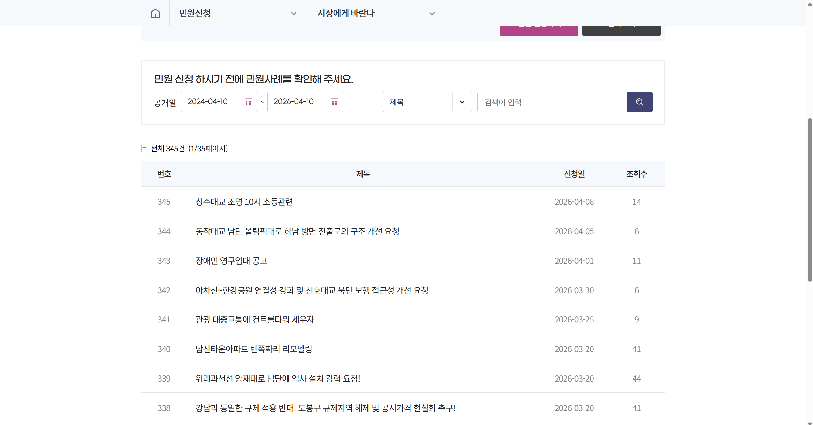
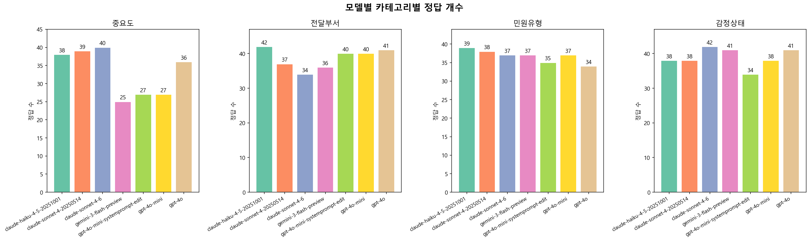
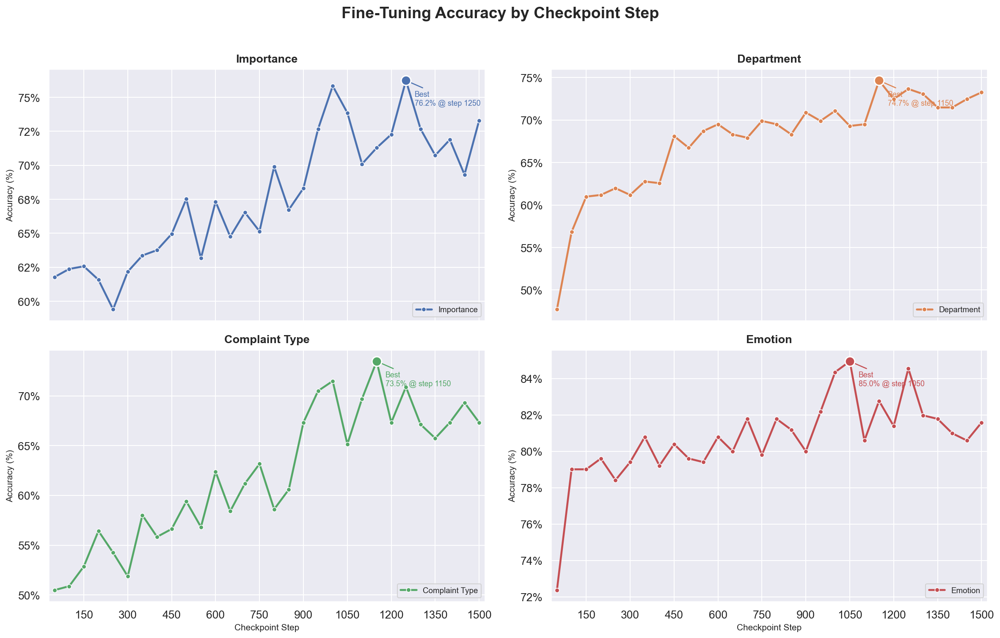
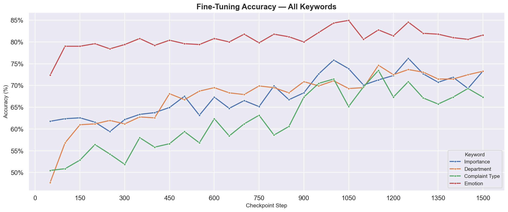

# Index

- [LLM Fine-Tuning](#llm-fine-tuning)
- [Final Model](#final-model)
- [Dataset](#dataset)
  - [1. Raw Data](#1-raw-data)
  - [2. Labeled Data](#2-labeled-data)
    - [System Prompt](#system-prompt)
    - [비용 & 정확도 측정](#비용--정확도-측정)
- [Fine Tuning](#fine-tuning)
  - [과정](#과정)
    - [1. Dataset & Model](#1-dataset--model)
    - [2. 일반화 방지](#2-일반화-방지)
    - [3. 주요 Configs](#3-주요-configs)
    - [4. collate_fn](#4-collate_fn)
  - [결과](#결과)
    - [FineTuned & Base Model 출력 비교](#finetuned--base-model-출력-비교)
    - [FineTuning Checkpoint - 키워드 정답률 그래프](#finetuning-checkpoint---키워드-정답률-그래프)
  - [핵심 결론](#핵심-결론)


<br>

---

<br>

# LLM Fine-Tuning

<div align = 'center'>
  
</div>

**개요**

이 프로젝트는 LoRA(Low-Rank Adaptation) 기법으로 모델 레이어에 학습 가능한 Low-Rank 행렬을 삽입해, 적은 파라미터로도 모델의 일반화 능력을 유지하며 Fine-Tuning하는 PEFT (Parameter Efficient Fine Tuning) 프로젝트입니다. Fine-Tuning 된 모델은 HuggingFace에 업로드하여 누구나 사용할 수 있도록 했습니다.

**목적**

Fine-Tuning의 목적은 천만 서울시민의 의견을 접수받는 온라인 민원신청 창구 '서울시 응답소'에 업로드 되는 수 많은 민원 글들을 인력의 개입 없이 그 중요도와 책임 소재가 따르는 부서를 분석해 빠르게 분류하여 민원 처리의 효율성 증대와 시간 단축을 달성하기 위함입니다. 이를 위해 서울시 응답소에 업로드 되어 있는 공개된 민원 글들을 Web Crawling을 통해 수집하고 Fine-Tuning용 데이터세트로 정제하여 훈련에 사용했습니다. 

<br><br><br>

# Final Model


Model Link : https://huggingface.co/leejunho12316/qwen2.5-0.5b-finetuned-checkpoint1150

<br>

# Dataset

RAW Data Link : https://huggingface.co/datasets/leejunho12316/seoul-mayor-hope <br>
Labeled Data Link : https://huggingface.co/datasets/leejunho12316/seoul-mayor-hope-labeled-backup2500

<br>

## 1. Raw Data
서울시 응답소 민원 Q&A 데이터셋
**서울시 응답소 - 시장에게 알린다**
https://eungdapso.seoul.go.kr/req/mayor_hope/mayor_hope.do

2011년 4분기부터 2026년 4월 중순까지 서울시 응답소 공식 홈페이지에 공개된 민원 데이터를 Web Crawling하여 수집.
시민이 서울시장에게 직접 민원·건의 사항을 올리면, 서울시가 답변하는 Q&A 형태의 공개 데이터.



<br>

- 데이터셋 예시

| 분류   | `title`<br>민원 제목                   | `Date`<br>민원 접수 날짜 | `Question`<br>민원 내용                                       | `Answer`<br>답변 내용                                            |`rceptNo_enc`<br>암호화된 민원 고유 접수번호
|------|------------------------------------|--------------------|-----------------------------------------------------------|--------------------------------------------------------------|-----------------|
| 1    | 서울의 공공디자인은 문화컨텐츠 스토리텔링으로 리모델링을---- | 2011-12-31         | 시장님! 서울의 디자인서울정책은 공공디자인 정책으로 많은 변화를 가져왔습니다. 물론 부정적 이미지... | 000 님 안녕하십니까? 서울시장 박원순입니다. 서울의 공공디자인을 문화컨텐츠 스토리텔링으로 리모델링... | X-cCuvM...
| 5000 | 우이동 경전철 공사로인한 도로및 지하실 침하           | 2015-08-11         |"2012년 부터 시작된 건물앞 경전철 공사로 인한 건물의 균열 도로침하,지하실 물난리등 수차래 ...|"000님 안녕하세요?\r\n000님의 메일 잘 받아보았습니다. 우이-신설 경전철공사로 인해 도로 침하 및 지하실 균열로 건물에...|qwhcvXJ2gq...
| 9999 | 목동123단지 도계위 통과 요청                  | 2018-05-02         |"시장님,\r\n이제 목동123단지 3종 환원을 담은 목동지구단위 계획이 다음주면 주민공람을...|"시정발전에 깊은 관심을 가지고 협조하여 주심에 감사의 말씀을 드립니다.\r\n \n목동아파..| iC_fJLG9...
| ...  | ...                                | ...                |...|...|...


<br>

- 데이터셋 정제

13,540행 -> 13,184행

원본 대비 **356건**의 이상 데이터(결측값, 중복, 특정 유형 등)를 제거.

- 결측값(NaN) 제거: `Question` 또는 `Answer`가 비어있는 행 삭제.
- 중복 데이터 제거: `Question` 중복 행 삭제 -> 도배글, 어그로성 글, 중복 비난글 다수.
- 기타 데이터 제거 : 첨부된 이미지나 파일이 있지만 서버/홈페이지의 문제로 유실되고 내용을 알 수 없는 데이터. 기다 다른 목적으로 입력한 데이터. 길이가 비정상적으로 짧은 데이터 등.

<br><br><br>

## 2. Labeled Data

민원을 분석해 LLM이 최종적으로 출력해야 할 assistant label 데이터를 생성.

- 데이터셋 예시

|Raw Data와 동일|assistant|
|---|---|
|...|"{""importance"": ""높음"", ""department"": ""경제실"", ""complaint_Type"": ""항의"", ""emotion"": ""부정""}"
|...|{"importance": "높음", "department": "주택실", "complaint_Type": "항의", "emotion": "부정"}
|...|{"importance": "보통", "department": "문화본부", "complaint_Type": "건의", "emotion": "부정"}

<br>

### System Prompt
RAGAS Prompt를 응용하여 importance, department, complaint_type, emotion 4가지의 키워드를 도출하도록 System Prompt 작성. 

**with_structured_output** <br>
BaseModel을 상속받는 사용자 정의 데이터형식 클래스와 with_structured_output을 사용하여 JSON 형식으로 일관된 출력 제한.

| # | 키워드 | 설명 |
|---|--------|------|
| 1 | `importance` | 민원의 중요도를 구분하는 label. 민원이 빠르게 처리되어 도움을 받아야 하면 높음, 일반적인 의견 전달이라면 보통, 감정적이고 비난을 담은 글이라면 낮음. |
| 2 | `department` | 해당 민원이 전달되어야 하는 부서를 판별하는 label. 서울시 조직도를 참고하여 부서 별 맡은 역할을 요약해 작성. ([서울특별시 조직도](https://org.seoul.go.kr/mobile/org/orgChart.do)) |
| 3 | `complaint_type` | 민원의 유형을 구분하는 label. 신고, 문의, 건의, 항의, 칭찬 그리고 그 외로 분류. |
| 4 | `emotion` | 민원인의 감정상태를 구분하는 label. 긍정, 중립, 부정으로 분류. |

<br>

```
SYSTEM_PROMPT = """당신은 서울시 민원 분류 담당관입니다. 지금부터 민원과 민원에 대한 답변을 읽고 키워드를 추출해주세요.
민원은 제목인 Title과 본문인 Question으로 구분되어 입력됩니다.
민원에 대한 답변은 Answer로 입력됩니다.

1. importance
Title과 Question을 보고 해당 민원의 중요도를 파악해 높음, 보통, 낮음 중 레이블을 구분하세요.
- 높음 : 행정적 조치, 전문적인 도움이 필요한 글. 특정한 문제가 발생했거나 부당한 처우에 대한 항의.
- 보통 : 보통의 의견이나 제안, 생각을 담은 글. 소식, 칭찬, 정보를 담은 글 등.
- 낮음 : 감정적으로만 작성한 글. 어그로성 글. 특정 개인에 대한 근거 없고 맹목적인 비난 글. 비논리적이고 문맥에 일관성이 없는 글. 작성이 온전히 다 되지 않은 글. 등

2. department
다음은 서울시의 각 부서가 담당하는 분야입니다. 민원 내용을 보고 해당 민원이 전달되어야 할 부서를 골라주세요.

- 교통실 : 버스·지하철·택시, 대중교통 정책, 자전거·킥보드·보행, 주차, 신호, 불법주정차, 한강버스, 교통카드, 도로교통, 자율주행
- 복지실 : 기초생활보장, 저소득층 지원, 노숙인, 어르신 돌봄, 장애인 지원, 아동·청소년 복지, 한부모·다문화가족, 중장년 지원
- 경제실 : 창업·스타트업, 소상공인·전통시장 지원, 청년 취업·일자리, 중소기업 자금, 소비자 권익, 생활임금·노동정책, 자영업자, 지원금
- 기후환경본부 : 쓰레기·재활용, 소각장, 미세먼지·대기질, 동물보호, 탄소중립·신재생에너지, 친환경차·전기차 충전, 도시공원, 식품안전
- 문화본부 : 도서관, 박물관·문화시설, 공연·예술 지원, 문화유산, 전통문화, 관광 계획, 공원 시설 관리/조성
- 시민건강국 : 보건소, 응급의료, 감염병·방역, 정신건강, 예방접종, 치매 예방, 공중위생, 건강증진, 마약 대응, 금연 지원, 금연구역 관리
- 재난안전실 : 재난대응, 취약시설 점검, 도로·보도 안전, 대피소, 시민안전보험, 제설, 인파 안전관리, 도로공사 안전 관리, 공사현장 관리
- 주택실 : 재개발·재건축, 공공주택, 전세사기, 건축인허가, 도시계획, 주거환경개선, 도시재생, 시설물 관리, 공공시설 관리, 부동산, 사유지
- 여성가족실 : 보육·어린이집, 저출생 대응, 아동학대 예방, 청소년 지원·보호, 성폭력·성희롱 예방, 디지털성범죄, 여성 안전, 양성평등
- 분류 보류 : 정부 부서 관할 이외의 기관에 대한 내용. 정치적인 내용.

단, Answer를 제외한 민원(Title과 Question)을 보았을 때 다음의 경우에 해당한다면 '분류 보류'를 설정하세요.
- Title과 Question만으로 민원의 주제를 알 수 없어 특정 부서를 분류할 수 없는 경우
- 첨부 파일을 업로드 했다고 되어 있으나 Title과 Question만으로 어떤 내용인지 유추할 수 없는 경우.
- Title과 Question이 내용을 알 수 없을 정도로 짧은 경우.

3. complaint_type
Title과 Question을 보고 민원의 유형을 다음 중 하나로 구분하세요
- 신고 : 불법 행위, 위험 상황, 규정 위반 등 제3자나 시설에 대한 문제를 알리는 경우
- 문의 : 제도, 정책, 절차, 방법 등에 대한 정보나 안내를 요청하는 경우
- 건의 : 정책 개선, 시설 설치, 제도 변경 등을 제안하는 경우
- 항의 : 행정 처리나 처우에 대한 불만을 표출하거나 시정을 요구하는 경우
- 칭찬 : 공무원, 서비스, 정책 등에 대한 긍정적인 평가를 담은 경우.
- 그 외 : 위 유형 중 어느 것으로도 분류되지 않는 경우.

4. emotion
Title과 Question을 보고 민원인의 감정상태를 긍정, 중립, 부정 중 하나로 구분하세요.

"""

```

<br>

### 비용 & 정확도 측정

label 생성 시 사용할 LLM 선정을 위해 비용과 정확도를 측정.

일관성 있는 labeling을 위해 비용과 정확도를 각각 실험.<br>
[2.ModelSelection](./2.ModelSelection)에 각 모델별 테스트 데이터 셋 50건에 대한 label 생성 데이터와 수동으로 제작한 labeling 정답 데이터가 있음.

<br>

1. 비용 : 50건의 데이터 처리 후 처리 가격과 특이사항 분석<br>

| 모델명                      | 50건 처리 가격 (달러) | 특이사항                                       |
  |--------------------------|---------------|--------------------------------------------|
  | gpt-4o-mini              |  <0.01 (10원 미만) | 비용 최저                                      |
  | gpt-4o                   | 0.27 (400원)  | TPM 자주 걸려 ERROR 다수 발생                      |
  | claude-sonnet-4-20250514 | 0.6 (890원)     | 레거시 모델. 같은 가격에 훨씬 높은 성능을 가진 sonnet 4.6이 있음 |
  | claude-sonnet-4-6        | 0.6 (890원)     | 처리 5분 넘게 걸림                                |
  | claude-haiku-4-5-20251001 | 0.2 (300원)     | 없음                                         |
  | gemini-3-flash-preview  | (354원)         | 처리 5분 넘게 걸림.                               |

<br>

2. 정확도 : 수동으로 50건의 민원에 대한 정답 데이터셋 생성 후 모델 별 키워드 별 정답률 도출.



| 모델 | 중요도 | 전달부서 | 민원유형 | 감정상태 |
|------|--------|----------|----------|----------|
| claude-haiku-4-5-20251001 | ➖ 38 | ✅ 42 | ✅ 39 | ➖ 38 |
| claude-sonnet-4-20250514 | ✅ 39 | ➖ 37 | ✅ 38 | ➖ 38 |
| claude-sonnet-4-6 | ✅ 40 | ❌ 34 | ➖ 37 | ✅ 42 |
| gemini-3-flash-preview | ❌ 25 | ❌ 36 | ➖ 37 | ✅ 41 |
| gpt-4o-mini | ❌ 27 | ➖ 40 | ➖ 37 | ➖ 38 |
| gpt-4o | ➖ 36 | ✅ 41 | ❌ 34 | ✅ 41 |

✅ : 준수 (상위 2등) <br>
➖ : 보통 <br>
❌ : 아쉬움 (하위 2등) <br>
-> 가장 중요한 label인 전달부서를 잘 분류하면서 '준수'항목이 2개 이상, 비용 효율적인 **claude-haiku-4-5-20251001**로 결정


<br><br><br>

---

<br>

# Fine Tuning

모델 Fine-Tuning Code : [4_Fine_Tuning_Code_RUNPOD.ipynb](4_Fine_Tuning_Code_RUNPOD_Qwen2.5_settings.ipynb)

모델 Fine-Tuning Checkpoints URL : https://drive.google.com/drive/folders/1RmdBCgtYumGUKC2ZG-zGPpTCe2gGMdrx?usp=drive_link

<br>

## 과정

### 1. Dataset & Model & Infrastructure

Dataset : [Labeled Data](https://huggingface.co/datasets/leejunho12316/seoul-mayor-hope-labeled-backup2500)를 Train : Test = 4 : 1로 분할하여 사용. (총 2500행)

Base Model : [Qwen/Qwen2.5-0.5B-Instruct](https://huggingface.co/Qwen/Qwen2.5-0.5B-Instruct)

Infrastructure : [RunPod](https://www.runpod.io/), NVIDIA A40 (48GM VRAM), 학습 소요 시간 약 25분

<br>

### 2. 일반화 방지
System Prompt 항목별 순서 Shuffle

System Prompt 내 `importance`, `department`, `complaint_type`, `emotion` 각 항목의 레이블 리스트를 매 샘플마다 `random.shuffle()`로 순서를 섞어 데이터를 구성. 모델이 특정 레이블의 등장 순서를 암기하지 않고, 각 레이블의 의미를 학습하도록 유도하기 위함.

```python
def get_system_prompt():
    importance_items = [("높음", "..."), ("보통", "..."), ("낮음", "...")]
    random.shuffle(importance_items)  # 순서 섞기

    department_items = [("교통실", "..."), ("복지실", "..."), ...]
    random.shuffle(department_items) # 순서 섞기
    ...
```

<br>


### 3. 주요 Configs

- LoRAConfig

| parameter        | value                  | 설명                                     |
|------------------|------------------------|----------------------------------------|
| `lora_alpha`     | 32                     | LoRA 스케일링 계수. 가중치 업데이트가 모델에 미치는 영향 조정. |
| `lora_dropout`   | 0.1                    | 과적합 방지하는 드롭아웃 확률.                      |
| `r`              | 8                      | LoRA 랭크. 저차원 공간의 크기 설정.                |
| `target_modules` | `["q_proj", "v_proj"]` | LoRA를 적용할 레이어.                         |
| `bias`           | `"none"`               | LoRA 적용 시 편향 처리 방식.                    |
| `task_type`      | `"CAUSAL_LM"`          | LoRA가 적용되는 작업 유형.                      |

<br>

- SFTConfig

| 파라미터 | 값 | 설명                                                                                              |
|---|---|-------------------------------------------------------------------------------------------------|
| `num_train_epochs` | 3 | 전체 데이터셋 학습 반복 횟수                                                                                |
| `per_device_train_batch_size` | 2 | GPU당 배치 크기                                                                                      |
| `gradient_accumulation_steps` | 2 | 그래디언트 누적 스텝. 유효 배치 크기 = per_device_train_batch_size x gradient_accumulation_steps = 2×2 = **4** |
| `learning_rate` | 1e-4 | 학습률                                                                                             |
| `lr_scheduler_type` | `"constant"` | 워밍업 이후 학습률 고정 유지                                                                                |
| `warmup_ratio` | 0.03 | 전체 스텝의 3%를 학습률 선형 증가 구간으로 사용                                                                    |
| `max_grad_norm` | 0.3 | 그래디언트 클리핑 임계값. 폭발적 그래디언트 방지                                                                     |
| `max_seq_length` | 8192 | 최대 시퀀스 길이                                                                                       |
| `optim` | `"adamw_torch_fused"` | Optimizer 설정 (PyTorch Fused AdamW)                                                              |

<br>

### 4. collate_fn

PyTorch DataLoader가 내부적으로 사용하는 collate_fn 를 변형한 핵심 전처리 함수. DataSet으로부터 배치를 입력받으면 모델의 Chat Template를 고려해 모델 입력 형식으로 변환.

**동작 방식**

1. DataSet으로부터 입력받은 OpenAI 형식 메시지를 Qwen Chat Template 형식으로 변환
- input_ids : Chat Template 적용 결과를 전체 토큰화 
- attention_mask : 토큰화된 길이만큼 1로 설정
- labels : assistant 특수 토큰`<|im_start|>assistant`가 끝나는 부분부터 `<|im_end|>`까지의 구간을 탐색하여 해당 토큰에만 실제 token ID를 레이블로 설정, 나머지는 손실 계산 미포함하도록 -100으로 초기화.
> labels의 -100은 PyTorch CrossEntropyLoss에서 무시되는 값. System-User + assistant 특수 토큰 구간은 Loss 계산에서 제외하고, 모델이 생성해야 하는 assistant 응답 부분만 학습하도록 유도.
2. 배치 내 최대 길이에 맞춰 **padding** 적용
- input_ids : tokenizer.pad_token_id 적용
- attention_mask : 0 적용
- labels : -100 적용
 
<br>

**처리 예시**

```
[입력 텍스트]
{'messages': [{'content': "SYSTEM_PROMPT = 당신은 서울시 민원 분류 담당관입니다. 지금부터 민원과 민원에 대한 답변을 읽고 키워드를 추출해주세요.\n민원은 제목인 Title과 본문인 Question으로 구분되어 입력됩니다.\n이때 파이썬의 Dictionary 형태로 반환하세요.\n\n1. importance\nTitle과 Question을 보고 해당 민원의 중요도를 파악해 높음, 낮음, 보통 중 레이블을 구분하세요.\n- 높음 : 행정적 조치, 전문적인 도움이 필요한 글. 특정한 문제가 발생했거나 부당한 처우에 대한 항의.\n- 낮음 : 감정적으로만 작성한 글. 어그로성 글. 특정 개인에 대한 근거 없고 맹목적인 비난 글. 비논리적이고 문맥에 일관성이 없는 글. 작성이 온전히 다 되지 않은 글. 등\n- 보통 : 보통의 의견이나 제안, 생각을 담은 글. 소식, 칭찬, 정보를 담은 글 등.\n\n2. department\n다음은 서울시의 각 부서가 담당하는 분야입니다. 민원 내용을 보고 해당 민원이 전달되어야 할 부서를 골라주세요.\n\n- 여성가족실 : 보육·어린이집, 저출생 대응, 아동학대 예방, 청소년 지원·보호, 성폭력·성희롱 예방, 디지털성범죄, 여성 안전, 양성평등\n- 복지실 : 기초생활보장, 저소득층 지원, 노숙인, 어르신 돌봄, 장애인 지원, 아동·청소년 복지, 한부모·다문화가족, 중장년 지원\n- 분류 보류 : 정부 부서 관할 이외의 기관에 대한 내용. 정치적인 내용.\n- 재난안전실 : 재난대응, 취약시설 점검, 도로·보도 안전, 대피소, 시민안전보험, 제설, 인파 안전관리, 도로공사 안전 관리, 공사현장 관리\n- 경제실 : 창업·스타트업, 소상공인·전통시장 지원, 청년 취업·일자리, 중소기업 자금, 소비자 권익, 생활임금·노동정책, 자영업자, 지원금\n- 주택실 : 재개발·재건축, 공공주택, 전세사기, 건축인허가, 도시계획, 주거환경개선, 도시재생, 시설물 관리, 공공시설 관리, 부동산, 사유지\n- 시민건강국 : 보건소, 응급의료, 감염병·방역, 정신건강, 예방접종, 치매 예방, 공중위생, 건강증진, 마약 대응, 금연 지원, 금연구역 관리\n- 교통실 : 버스·지하철·택시, 대중교통 정책, 자전거·킥보드·보행, 주차, 신호, 불법주정차, 한강버스, 교통카드, 도로교통, 자율주행\n- 문화본부 : 도서관, 박물관·문화시설, 공연·예술 지원, 문화유산, 전통문화, 관광 계획, 공원 시설 관리/조성\n- 기후환경본부 : 쓰레기·재활용, 소각장, 미세먼지·대기질, 동물보호, 탄소중립·신재생에너지, 친환경차·전기차 충전, 도시공원, 식품안전\n\n단, Answer를 제외한 민원(Title과 Question)을 보았을 때 다음의 경우에 해당한다면 '분류 보류'를 설정하세요.\n- Title과 Question만으로 민원의 주제를 알 수 없어 특정 부서를 분류할 수 없는 경우\n- 첨부 파일을 업로드 했다고 되어 있으나 Title과 Question만으로 어떤 내용인지 유추할 수 없는 경우.\n- Title과 Question이 내용을 알 수 없을 정도로 짧은 경우.\n\n3. complaint_type\nTitle과 Question을 보고 민원의 유형을 다음 중 하나로 구분하세요\n- 문의 : 제도, 정책, 절차, 방법 등에 대한 정보나 안내를 요청하는 경우\n- 신고 : 불법 행위, 위험 상황, 규정 위반 등 제3자나 시설에 대한 문제를 알리는 경우\n- 항의 : 행정 처리나 처우에 대한 불만을 표출하거나 시정을 요구하는 경우\n- 그 외 : 위 유형 중 어느 것으로도 분류되지 않는 경우.\n- 칭찬 : 공무원, 서비스, 정책 등에 대한 긍정적인 평가를 담은 경우.\n- 건의 : 정책 개선, 시설 설치, 제도 변경 등을 제안하는 경우\n\n4. emotion\nTitle과 Question을 보고 민원인의 감정상태를 긍정, 부정, 중립 중 하나로 구분하세요.\n",
   'role': 'system'},
{'content': 'Title: 하자 있는 행정행위는 어디에 호소해야 합니까?\nQuestion : 2014.7.2 노량진청과물도매시장 폐지가 결정이 됬다는데, 시장폐지에 관한 아무런 정보와 내용을 이해관련이 있는 시장상인들이 전혀 모르고 있었습니다.! 동작구청 도시계획과 심재두 주무관에게 물어보니. 토지주 1~2명이 주민으로 의견청취가 됬다고 하는데요.정말 기가막히고 어이가 없습니다.\r\n청과시장에서 근 20~30년 넘게 장사를 하고 있는 상인들은 관련주민으로서의 권리조차 없는겁니까?더 이상한 것은 "국토의 계획 및 이용에 관한 법률 제 26조와 제 28조"에서 규정하는 있는 것으로 주민의견청취 절차상 요건에 포함이 되었다고 알고 있는데도 불구하고, 그 문구에 인위적으로 맞추기 위한 공평하지 못한 처리절차가 궁금합니다.토지소유자들이 제안하고 토지소유자들의 의견청취가 주민의견청취에 합당한 것입니까?상가에 합당한 세금을 내고 매달 임대료와 그외 여러가지 유지.보수료를 내고 장사를 하고 있었던 상인들의 의견을 완전히 배제시키고 "시장폐지"의 큰 일을 진행한 동작구청 도시계획과 담당직원의 이상한 행정상의 일련의 업무처리가 도저히 이해가 안되고 납득이 안됩니다!!\r\n담당자는 "법에 위반하지 않았다"라고 되려 큰소리 칩니다.!!\r\n상인들이 와전히 배재된 주민의견청취가 과연 행정상 옳은 처리과정입니까?\r\n그럼 토지소유자와 관련구청.직원과의 서류절차 하나만으로도 "시장폐지"는 가능합니까?그곳에서 20~30년 넘게 장사를 했던 상인들은 전혀 주민으로서 권리도 없구요.!\r\n동작구청에 민원을 넣은들. 같은 대답 돌아고.(당사자들끼리 알아서 하고 민사로 진행하라고 권유받음.)\r\n그전에 제가 궁금한 것은.."노량진청과물도매시장 시장폐지"에 관해서 동작구 도시계획과 직원이 말한 토지소유자1~2명의 주민의견청취만으로도 절차에 하자가 없는지 궁금합니다.\r\n자세한 조사 부탁드립니다.!!',
   'role': 'user'},
{'content': '{"importance": "높음", "department": "주택실", "complaint_Type": "항의", "emotion": "부정"}',
   'role': 'assistant'}]}
```

<br>

```
[Chat Template 적용]
<|im_start|>system\nSYSTEM_PROMPT = 당신은 서울시 민원 분류 담당관입니다. 지금부터 민원과 민원에 대한 답변을 읽고 키워드를 추출해주세요.\n민원은 제목인 Title과 본문인 Question으로 구분되어 입력됩니다.\n이때 파이썬의 Dictionary 형태로 반환하세요.\n\n1. importance\nTitle과 Question을 보고 해당 민원의 중요도를 파악해 높음, 낮음, 보통 중 레이블을 구분하세요.\n- 높음 : 행정적 조치, 전문적인 도움이 필요한 글. 특정한 문제가 발생했거나 부당한 처우에 대한 항의.\n- 낮음 : 감정적으로만 작성한 글. 어그로성 글. 특정 개인에 대한 근거 없고 맹목적인 비난 글. 비논리적이고 문맥에 일관성이 없는 글. 작성이 온전히 다 되지 않은 글. 등\n- 보통 : 보통의 의견이나 제안, 생각을 담은 글. 소식, 칭찬, 정보를 담은 글 등.\n\n2. department\n다음은 서울시의 각 부서가 담당하는 분야입니다. 민원 내용을 보고 해당 민원이 전달되어야 할 부서를 골라주세요.\n\n- 여성가족실 : 보육·어린이집, 저출생 대응, 아동학대 예방, 청소년 지원·보호, 성폭력·성희롱 예방, 디지털성범죄, 여성 안전, 양성평등\n- 복지실 : 기초생활보장, 저소득층 지원, 노숙인, 어르신 돌봄, 장애인 지원, 아동·청소년 복지, 한부모·다문화가족, 중장년 지원\n- 분류 보류 : 정부 부서 관할 이외의 기관에 대한 내용. 정치적인 내용.\n- 재난안전실 : 재난대응, 취약시설 점검, 도로·보도 안전, 대피소, 시민안전보험, 제설, 인파 안전관리, 도로공사 안전 관리, 공사현장 관리\n- 경제실 : 창업·스타트업, 소상공인·전통시장 지원, 청년 취업·일자리, 중소기업 자금, 소비자 권익, 생활임금·노동정책, 자영업자, 지원금\n- 주택실 : 재개발·재건축, 공공주택, 전세사기, 건축인허가, 도시계획, 주거환경개선, 도시재생, 시설물 관리, 공공시설 관리, 부동산, 사유지\n- 시민건강국 : 보
```
<br>

```
[input_ids]
[151644, 8948, 198, 46487, 71346, 2828, 284, 131502, 33704, 136905, 29326, 125713, 120, 54321, 128618, 97929, 34143, 112, 64795, 124780, 78952, 13, 129082, 126558, 125713, 120, 54321, 53680, 125713, 120, 54321, 19391, 128605, 143604, 17877, 16751, 121, 34395, 10764, 92120, 130109, 29346, 18411, 57835, 69923, 33883, 91669, 624, 125496, 54321, 33704, 62071, 87608, 31328, 10869, 53680, 129238, 51588, 31328, 15846, 42039, 58777, 79716, 128993, 42349, 130885, 624, 12802, 131866, 54969, 12802, 144773, 20401, 10466, 141966, 17380, 94879, 91145, 382, 16, 13, 12650, 198, 3851, 53680, 15846, 17877, 63332, 34395, 94613, 125713, 120, 54321, 20401, 127840, 47985, 18411, 54969, 131893, 33883, 63332, 125160, 11, 37195, 106, 48431, 11, 5140, 228, 240, 48431, 70943, 5140, 254, 230, 12802, 135032, 17877, 58777, 79716, 91145, 624, 12, 63332, 125160, 549, 63332, 125160, 20401, 140264, 129835, 62071, 126246, 11, 128646, 17877, 34143, 112, 33704, 131522, 13, 126291, 76337, 11, 90711, 255, 138143, 11, 60039, 18411, 34143, 112, 33704, 131522, 77002, 624, 12, 37195, 106, 48431, 549, 129423, 29281, 128552, 72553, 140174, 23573, 131522, 13, 124685, 48606, 17380, 32831, 131522, 13, 142976, 126799, 19391, 128605, 134312, 120, 92192, 46682, 34395, 32985, 117, 87608, 128533, 73986, 126588, 131522, 13, 73986, 132523, 28002, 80968, 133215, 53435, 144026, 19391, 83556, 124780, 137032, 130768, 131522, 13, 68232, 137032, 38523, 101, 65865, 125511, 49367, 97143, 21329, 136278, 131522, 13, 77002, 198, 12, 5140, 228, 240, 48431, 549, 126174, 29281, 80968, 65510, 59698, 11, 56419, 51588, 128533, 129392, 133914, 12802, 134028, 131522, 13, 142976, 23573, 137903, 133396, 125580, 127451, 85403, 64795, 23573, 71647, 40281, 19391, 128605, 142654, 20401, 382, 17, 13, 9292, 198, 13146, 48431, 33704, 136905, 29326, 20401, 126804, 85403, 26698, 19969, 34143, 112, 64795, 42905, 128618, 89659, 78952, 13, 125713, 120, 54321, 130213, 17877, 63332, 34395, 94613, 125713, 120, 54321, 12802, 56419, 129062, 128993, 89659, 95002, 85403, 26698, 18411, 45130, 101, 50340, 91669, 382, 12, 54116, 127033, 132892, 125822, 63089, 549, 3315, 241, 108, 126673, 20487, 13935, 57132, 125991, 26699, 11, 126291, 126317, 40853, 11, 125714, 41429, 141893, 21329, 13935, 66845, 20487, 128732, 11, 126322, 126251, 131505, 11, 74361, 226, 43590, 126402, 126702, 13935, 82528, 57132, 76435, 142653, 11, 90711, 250, 132892, 125625, 13935, 65865, 20487, 125625, 36330, 102, 65865, 11, 129392, 29326, 78125, 54321, 11, 28927, 251, 125678, 126246, 65865, 198, 12, 53435, 56290, 125822, 63089, 549, 129392, 26698, 124780, 11, 22042, 243, 126251, 124780, 13935, 131655, 132555, 11, 125466, 125568, 13935, 143788, 132185, 11, 53435, 56290, 125522, 85057, 11, 56419, 125160, 131655, 11, 92751, 126861, 94203, 127324, 11, 125466, 54321, 44518, 125624, 92751, 28002, 14, 92817, 32831, 198, 12, 30520, 113, 21329, 125086, 549, 54116, 132618, 133830, 41671, 40853, 11, 125569, 43590, 132524, 137812, 132185, 11, 127042, 135363, 31328, 11, 124685, 125548, 82528, 137843, 144271, 11, 129359, 126898, 31328, 132185, 11, 48408, 57089, 13935, 143413, 30520, 113, 21329, 11, 61298, 63089, 129439, 13935, 13146, 131655, 19969, 129704, 11, 70943, 40853, 126216, 132185, 198, 12, 128618, 97929, 63332, 97929, 549, 36055, 63089, 85403, 26698, 92751, 47836, 23084, 128792, 20401, 54116, 124780, 19391, 128605, 130213, 13, 136994, 128533, 130213, 624, 12, 43115, 37087, 125086, 549, 62099, 121, 124517, 13935, 141274, 28626, 124517, 11, 126291, 55902, 78125, 31328, 13935, 65865, 125160, 133627, 132185, 11, 48364, 255, 126216, 131565, 124517, 13935, 32077, 25715, 28002, 11, 70943, 43590, 131754, 64577, 125052, 11, 126291, 70582, 25715, 142452, 131870, 11, 47818, 125991, 93701, 125052, 13935, 135349, 133286, 11, 64577, 125144, 124517, 25715, 11, 132185, 125052, 198, 12, 129242, 126588, 126246, 65865, 125086, 549, 129242, 126588, 66845, 131518, 11, 131565, 125535, 132555, 18585, 238, 129845, 11, 129392, 17380, 13935, 41671, 47985, 95170, 65865, 11, 60960, 129262, 43590, 11, 44518, 125496, 126246, 65865, 135664, 11, 62071, 125624, 11, 58677, 126793, 95170, 65865, 129576, 11, 129392, 17380, 78125, 55054, 95170, 65865, 92751, 28002, 11, 125466, 55054, 126407, 40853, 92751, 28002, 198, 12, 55673, 127919, 125086, 549, 129242, 131570, 13935, 57132, 143483, 11, 125466, 78125, 142846, 11, 56419, 41429, 55054, 20487, 11, 130270, 53496, 66261, 131976, 19969, 11, 129392, 29326, 132597, 11, 55673, 92192, 132892, 59761, 125519, 11, 129392, 29326, 57132, 76435, 11, 44518, 125624, 126251, 92751, 28002, 11, 125466, 78125, 132555, 92751, 28002, 11, 85403, 57089, 85057, 11, 32129, 125522, 21329, 198, 12, 44518, 125496, 124873, 130262, 124785, 549, 63332, 124873, 43590, 11, 16751, 239, 128911, 20401, 63256, 11, 129423, 137284, 127148, 13935, 126321, 126346, 11, 36055, 82528, 124873, 130262, 11, 95617, 126321, 127302, 126337, 11, 90711, 246, 129865, 95617, 126321, 11, 125466, 126402, 80901, 76435, 11, 130270, 130262, 128844, 85251, 11, 95577, 125535, 60960, 131518, 11, 40771, 230, 125568, 132185, 11, 40771, 230, 137650, 126346, 92751, 28002, 198, 12, 140546, 19969, 129704, 125086, 549, 63332, 126596, 13935, 31079, 129807, 12802, 126886, 11, 125569, 69923, 76435, 60960, 131518, 11, 48408, 57089, 124632, 66845, 95617, 126321, 11, 48364, 255, 43590, 126216, 132185, 13935, 131505, 11, 128677, 135257, 28754, 13935, 32831, 125969, 144371, 95617, 126321, 11, 76497, 242, 21329, 144046, 32831, 130765, 132759, 11, 140546, 95170, 65865, 11, 79302, 239, 32831, 126742, 129510, 198, 12, 127048, 125160, 125086, 549, 86831, 24897, 13935, 21329, 16186, 131573, 13935, 127919, 29326, 11, 60960, 126402, 142438, 36055, 126712, 11, 64577, 65865, 92192, 13935, 145329, 41671, 29346, 13935, 41671, 124528, 11, 55673, 125625, 11, 128753, 47324, 11, 126488, 126270, 54330, 29281, 125625, 11, 61298, 130262, 79004, 24897, 11, 127048, 125160, 129616, 29346, 11, 129392, 17380, 142438, 11, 64577, 132841, 54330, 124528, 271, 125068, 11, 21806, 18411, 62071, 128792, 23573, 125713, 120, 54321, 7, 3851, 53680, 15846, 8, 17877, 63332, 126002, 17877, 53618, 126844, 20401, 49052, 19391, 94613, 140295, 364, 79716, 97929, 63332, 97929, 6, 18411, 65880, 91145, 624, 12, 10869, 53680, 15846, 72553, 42039, 125713, 120, 54321, 20401, 55673, 37087, 18411, 125214, 28733, 46682, 31079, 142976, 85403, 26698, 18411, 128618, 97929, 47836, 28733, 130768, 49052, 198, 12, 48364, 101, 63089, 67629, 17877, 24485, 227, 17380, 29346, 10764, 244, 19946, 34395, 97143, 31079, 135354, 60315, 10869, 53680, 15846, 72553, 42039, 129273, 130213, 134039, 126310, 132526, 47836, 28733, 130768, 49052, 624, 12, 10869, 53680, 15846, 12802, 130213, 17877, 125214, 28733, 46682, 17877, 131219, 17380, 47911, 100, 33704, 49052, 382, 18, 13, 12181, 1819, 198, 3851, 53680, 15846, 17877, 63332, 34395, 125713, 120, 54321, 20401, 126310, 128909, 17877, 126844, 70943, 125703, 17380, 58777, 79716, 91145, 198, 12, 128753, 34395, 549, 126488, 126270, 126174, 80901, 11, 45710, 125341, 58034, 130803, 11, 134314, 45710, 126641, 77002, 62071, 18, 25715, 60315, 44518, 125624, 19391, 128605, 126674, 18411, 125214, 132920, 49052, 198, 12, 142654, 20401, 549, 126174, 29281, 81058, 60315, 71647, 40281, 19391, 128605, 126488, 72553, 17877, 139052, 69923, 135405, 44518, 29281, 17877, 135797, 42905, 49052, 198, 12, 54825, 74884, 116, 549, 45710, 126310, 128909, 70943, 133487, 132091, 47985, 128618, 97929, 132553, 127728, 49052, 624, 12, 90711, 255, 138143, 549, 125466, 125054, 54321, 11, 130778, 11, 36055, 126712, 77002, 19391, 128605, 40771, 235, 29281, 128533, 69441, 231, 19969, 18411, 34143, 112, 33704, 49052, 624, 12, 130270, 20401, 549, 36055, 126712, 73523, 125519, 11, 44518, 125624, 134739, 11, 62071, 47985, 87737, 134454, 62071, 126246, 42905, 49052, 198, 12, 53435, 20401, 549, 62071, 47985, 11, 36055, 126712, 11, 18585, 230, 125625, 11, 130864, 77002, 19391, 128605, 60039, 60315, 95170, 95218, 18411, 142163, 42905, 49052, 271, 19, 13, 19772, 198, 3851, 53680, 15846, 17877, 63332, 34395, 125713, 120, 54321, 31328, 20401, 129423, 29281, 55902, 86372, 18411, 70943, 126702, 11, 40771, 235, 29281, 11, 85403, 29281, 70943, 125703, 17380, 58777, 79716, 91145, 624, 151645, 198, 151644, 872, 198, 3851, 25, 53900, 25715, 64521, 126174, 29281, 136414, 16560, 139740, 19391, 91043, 43590, 129264, 20136, 102, 125716, 5267, 14582, 549, 220, 17, 15, 16, 19, 13, 22, 13, 17, 127042, 131837, 85251, 125118, 53680, 126251, 47985, 129865, 133627, 69441, 238, 21329, 19969, 135763, 12802, 72344, 105, 13146, 126551, 11, 44518, 40853, 136203, 21329, 19391, 130207, 134006, 125120, 60039, 80573, 130213, 17877, 133329, 124780, 125747, 12802, 64521, 44518, 40853, 55902, 31328, 126253, 143552, 136105, 34395, 35339, 127750, 61350, 126322, 67511, 88259, 125118, 129392, 29326, 132597, 53680, 28927, 105, 57132, 126923, 55673, 125054, 124780, 126327, 133553, 31079, 41671, 83036, 13, 10764, 228, 254, 21329, 54330, 220, 16, 93, 17, 79632, 12802, 55673, 125496, 42039, 140264, 125118, 137237, 19969, 72344, 105, 131042, 128956, 124419, 35711, 13, 29281, 127452, 54116, 19969, 127559, 125511, 34395, 124685, 12802, 19969, 136673, 3224, 125118, 53680, 133627, 56475, 134312, 120, 220, 17, 15, 93, 18, 15, 126216, 143835, 57801, 129359, 134445, 130127, 64521, 58034, 31328, 128901, 129985, 138533, 42039, 26698, 20401, 142453, 92817, 125625, 130768, 144048, 125716, 30, 125932, 130408, 23573, 129274, 330, 124785, 129283, 20401, 94203, 127324, 128355, 126563, 19391, 130207, 136324, 62071, 220, 17, 21, 92817, 80573, 62071, 220, 17, 23, 92817, 1, 56475, 134314, 42905, 64521, 132091, 55673, 125496, 20401, 126110, 125118, 137237, 18585, 230, 125625, 55902, 85997, 124873, 19391, 133970, 12802, 97143, 125761, 34395, 135420, 134563, 47985, 143682, 11, 54825, 53435, 88259, 19391, 58677, 80901, 128552, 131417, 132526, 20487, 130679, 125466, 126742, 87425, 129293, 23573, 81058, 140278, 19969, 142451, 223, 125052, 60838, 13, 129283, 21329, 43590, 125522, 25715, 126253, 62071, 126246, 126204, 10764, 228, 254, 21329, 43590, 125522, 25715, 129360, 140264, 125118, 137237, 19969, 55673, 125496, 20401, 126110, 125118, 137237, 19391, 20136, 102, 64795, 23573, 71108, 43866, 125716, 30, 55902, 19969, 19391, 20136, 102, 64795, 23573, 125674, 125052, 17877, 66136, 34395, 126932, 129062, 16235, 226, 66845, 63256, 80573, 54825, 128792, 127296, 19969, 21329, 139871, 13, 41671, 23259, 63256, 18411, 66136, 34395, 129359, 134445, 130127, 132236, 125615, 58034, 31328, 129360, 140264, 17877, 74884, 226, 65865, 125511, 73669, 37087, 135298, 34395, 330, 133627, 136203, 21329, 1, 20401, 132182, 138507, 132876, 23573, 126322, 67511, 88259, 125118, 129392, 29326, 132597, 53680, 34143, 112, 64795, 125545, 54321, 20401, 130408, 23573, 126174, 29281, 55902, 20401, 83556, 125747, 20401, 24485, 227, 125054, 131342, 19969, 129392, 126781, 125511, 133329, 19969, 95170, 130357, 37195, 102, 132524, 12802, 95170, 130885, 2928, 319, 140939, 132343, 330, 126270, 19391, 45710, 126641, 87425, 133995, 13146, 1, 129254, 97143, 125476, 132182, 43590, 28002, 90711, 48458, 13, 2928, 319, 55902, 31328, 126253, 74884, 222, 65865, 125511, 73669, 57132, 52300, 55673, 125496, 20401, 126110, 125118, 137237, 19969, 45130, 120, 125568, 126174, 29281, 55902, 38523, 111, 33704, 81058, 131889, 43866, 125716, 45349, 48606, 125894, 10764, 228, 254, 21329, 43590, 125522, 25715, 80573, 129985, 88259, 125118, 13, 125545, 54321, 53680, 20401, 89860, 97929, 140278, 125703, 72553, 42039, 47985, 330, 133627, 136203, 21329, 1, 16560, 95351, 128747, 125716, 30, 48606, 130638, 56475, 220, 17, 15, 93, 18, 15, 126216, 143835, 57801, 129359, 134445, 10764, 244, 230, 125615, 58034, 31328, 128901, 143552, 55673, 125496, 42039, 26698, 142453, 47985, 46682, 88259, 35711, 13, 45626, 57089, 67511, 88259, 125118, 19391, 125713, 120, 54321, 17877, 65553, 96, 33704, 64850, 13, 129381, 60960, 132760, 137844, 34395, 12832, 64795, 55054, 25715, 64850, 142063, 28002, 137676, 26698, 130127, 125713, 120, 55054, 17380, 132876, 16186, 129254, 142452, 125522, 132872, 48431, 13, 1218, 48606, 65865, 19391, 132254, 142451, 223, 125052, 23573, 129274, 37426, 127121, 131837, 85251, 125118, 53680, 126251, 47985, 129865, 133627, 44518, 40853, 136203, 21329, 1, 19391, 92751, 96137, 126322, 67511, 88259, 129392, 29326, 132597, 53680, 137351, 54321, 12802, 126254, 23573, 10764, 228, 254, 21329, 43590, 125522, 25715, 16, 93, 17, 79632, 20401, 55673, 125496, 20401, 126110, 125118, 137237, 72553, 42039, 47985, 18585, 230, 125625, 19391, 53900, 130427, 130768, 21329, 142451, 223, 125052, 60838, 3224, 25715, 41429, 23573, 65510, 55054, 85403, 133376, 141001, 13, 2928, 151645, 198, 151644, 77091, 198, 4913, 474, 681, 788, 330, 136919, 48431, 497, 330, 27314, 788, 330, 142846, 125086, 497, 330, 874, 31297, 13729, 788, 330, 126524, 20401, 497, 330, 73353, 788, 330, 63089, 29281, 9207, 151645]

[attention_mask]
[1, 1, 1, 1, 1, 1, 1, 1, 1, 1, 1, 1, 1, 1, 1, 1, 1, 1, 1, 1, 1, 1, 1, 1, 1, 1, 1, 1, 1, 1, 1, 1, 1, 1, 1, 1, 1, 1, 1, 1, 1, 1, 1, 1, 1, 1, 1, 1, 1, 1, 1, 1, 1, 1, 1, 1, 1, 1, 1, 1, 1, 1, 1, 1, 1, 1, 1, 1, 1, 1, 1, 1, 1, 1, 1, 1, 1, 1, 1, 1, 1, 1, 1, 1, 1, 1, 1, 1, 1, 1, 1, 1, 1, 1, 1, 1, 1, 1, 1, 1, 1, 1, 1, 1, 1, 1, 1, 1, 1, 1, 1, 1, 1, 1, 1, 1, 1, 1, 1, 1, 1, 1, 1, 1, 1, 1, 1, 1, 1, 1, 1, 1, 1, 1, 1, 1, 1, 1, 1, 1, 1, 1, 1, 1, 1, 1, 1, 1, 1, 1, 1, 1, 1, 1, 1, 1, 1, 1, 1, 1, 1, 1, 1, 1, 1, 1, 1, 1, 1, 1, 1, 1, 1, 1, 1, 1, 1, 1, 1, 1, 1, 1, 1, 1, 1, 1, 1, 1, 1, 1, 1, 1, 1, 1, 1, 1, 1, 1, 1, 1, 1, 1, 1, 1, 1, 1, 1, 1, 1, 1, 1, 1, 1, 1, 1, 1, 1, 1, 1, 1, 1, 1, 1, 1, 1, 1, 1, 1, 1, 1, 1, 1, 1, 1, 1, 1, 1, 1, 1, 1, 1, 1, 1, 1, 1, 1, 1, 1, 1, 1, 1, 1, 1, 1, 1, 1, 1, 1, 1, 1, 1, 1, 1, 1, 1, 1, 1, 1, 1, 1, 1, 1, 1, 1, 1, 1, 1, 1, 1, 1, 1, 1, 1, 1, 1, 1, 1, 1, 1, 1, 1, 1, 1, 1, 1, 1, 1, 1, 1, 1, 1, 1, 1, 1, 1, 1, 1, 1, 1, 1, 1, 1, 1, 1, 1, 1, 1, 1, 1, 1, 1, 1, 1, 1, 1, 1, 1, 1, 1, 1, 1, 1, 1, 1, 1, 1, 1, 1, 1, 1, 1, 1, 1, 1, 1, 1, 1, 1, 1, 1, 1, 1, 1, 1, 1, 1, 1, 1, 1, 1, 1, 1, 1, 1, 1, 1, 1, 1, 1, 1, 1, 1, 1, 1, 1, 1, 1, 1, 1, 1, 1, 1, 1, 1, 1, 1, 1, 1, 1, 1, 1, 1, 1, 1, 1, 1, 1, 1, 1, 1, 1, 1, 1, 1, 1, 1, 1, 1, 1, 1, 1, 1, 1, 1, 1, 1, 1, 1, 1, 1, 1, 1, 1, 1, 1, 1, 1, 1, 1, 1, 1, 1, 1, 1, 1, 1, 1, 1, 1, 1, 1, 1, 1, 1, 1, 1, 1, 1, 1, 1, 1, 1, 1, 1, 1, 1, 1, 1, 1, 1, 1, 1, 1, 1, 1, 1, 1, 1, 1, 1, 1, 1, 1, 1, 1, 1, 1, 1, 1, 1, 1, 1, 1, 1, 1, 1, 1, 1, 1, 1, 1, 1, 1, 1, 1, 1, 1, 1, 1, 1, 1, 1, 1, 1, 1, 1, 1, 1, 1, 1, 1, 1, 1, 1, 1, 1, 1, 1, 1, 1, 1, 1, 1, 1, 1, 1, 1, 1, 1, 1, 1, 1, 1, 1, 1, 1, 1, 1, 1, 1, 1, 1, 1, 1, 1, 1, 1, 1, 1, 1, 1, 1, 1, 1, 1, 1, 1, 1, 1, 1, 1, 1, 1, 1, 1, 1, 1, 1, 1, 1, 1, 1, 1, 1, 1, 1, 1, 1, 1, 1, 1, 1, 1, 1, 1, 1, 1, 1, 1, 1, 1, 1, 1, 1, 1, 1, 1, 1, 1, 1, 1, 1, 1, 1, 1, 1, 1, 1, 1, 1, 1, 1, 1, 1, 1, 1, 1, 1, 1, 1, 1, 1, 1, 1, 1, 1, 1, 1, 1, 1, 1, 1, 1, 1, 1, 1, 1, 1, 1, 1, 1, 1, 1, 1, 1, 1, 1, 1, 1, 1, 1, 1, 1, 1, 1, 1, 1, 1, 1, 1, 1, 1, 1, 1, 1, 1, 1, 1, 1, 1, 1, 1, 1, 1, 1, 1, 1, 1, 1, 1, 1, 1, 1, 1, 1, 1, 1, 1, 1, 1, 1, 1, 1, 1, 1, 1, 1, 1, 1, 1, 1, 1, 1, 1, 1, 1, 1, 1, 1, 1, 1, 1, 1, 1, 1, 1, 1, 1, 1, 1, 1, 1, 1, 1, 1, 1, 1, 1, 1, 1, 1, 1, 1, 1, 1, 1, 1, 1, 1, 1, 1, 1, 1, 1, 1, 1, 1, 1, 1, 1, 1, 1, 1, 1, 1, 1, 1, 1, 1, 1, 1, 1, 1, 1, 1, 1, 1, 1, 1, 1, 1, 1, 1, 1, 1, 1, 1, 1, 1, 1, 1, 1, 1, 1, 1, 1, 1, 1, 1, 1, 1, 1, 1, 1, 1, 1, 1, 1, 1, 1, 1, 1, 1, 1, 1, 1, 1, 1, 1, 1, 1, 1, 1, 1, 1, 1, 1, 1, 1, 1, 1, 1, 1, 1, 1, 1, 1, 1, 1, 1, 1, 1, 1, 1, 1, 1, 1, 1, 1, 1, 1, 1, 1, 1, 1, 1, 1, 1, 1, 1, 1, 1, 1, 1, 1, 1, 1, 1, 1, 1, 1, 1, 1, 1, 1, 1, 1, 1, 1, 1, 1, 1, 1, 1, 1, 1, 1, 1, 1, 1, 1, 1, 1, 1, 1, 1, 1, 1, 1, 1, 1, 1, 1, 1, 1, 1, 1, 1, 1, 1, 1, 1, 1, 1, 1, 1, 1, 1, 1, 1, 1, 1, 1, 1, 1, 1, 1, 1, 1, 1, 1, 1, 1, 1, 1, 1, 1, 1, 1, 1, 1, 1, 1, 1, 1, 1, 1, 1, 1, 1, 1, 1, 1, 1, 1, 1, 1, 1, 1, 1, 1, 1, 1, 1, 1, 1, 1, 1, 1, 1, 1, 1, 1, 1, 1, 1, 1, 1, 1, 1, 1, 1, 1, 1, 1, 1, 1, 1, 1, 1, 1, 1, 1, 1, 1, 1, 1, 1, 1, 1, 1, 1, 1, 1, 1, 1, 1, 1, 1, 1, 1, 1, 1, 1, 1, 1, 1, 1, 1, 1, 1, 1, 1, 1, 1, 1, 1, 1, 1, 1, 1, 1, 1, 1, 1, 1, 1, 1, 1, 1, 1, 1, 1, 1, 1, 1, 1, 1, 1, 1, 1, 1, 1, 1, 1, 1, 1, 1, 1, 1, 1, 1, 1, 1, 1, 1, 1, 1, 1, 1, 1, 1, 1, 1, 1, 1, 1, 1, 1, 1, 1, 1, 1, 1, 1, 1, 1, 1, 1, 1, 1, 1, 1, 1, 1, 1, 1, 1, 1, 1, 1, 1, 1, 1, 1, 1, 1, 1, 1, 1, 1, 1, 1, 1, 1, 1, 1, 1, 1, 1, 1, 1, 1, 1, 1, 1, 1, 1, 1, 1, 1, 1, 1, 1, 1, 1, 1, 1, 1, 1, 1, 1, 1, 1, 1, 1, 1, 1, 1, 1, 1, 1, 1, 1, 1, 1, 1, 1, 1, 1, 1, 1, 1, 1, 1, 1, 1, 1, 1, 1, 1, 1, 1, 1, 1, 1, 1, 1, 1, 1, 1, 1, 1, 1, 1, 1, 1, 1, 1, 1, 1, 1, 1, 1, 1, 1, 1, 1, 1, 1, 1, 1, 1, 1, 1, 1, 1, 1, 1, 1, 1, 1, 1, 1, 1, 1, 1, 1, 1, 1, 1, 1, 1, 1, 1, 1, 1, 1, 1, 1, 1, 1, 1, 1, 1, 1, 1, 1, 1, 1, 1, 1, 1, 1, 1, 1, 1, 1, 1, 1, 1, 1, 1, 1, 1, 1, 1, 1, 1, 1, 1, 1, 1, 1, 1, 1, 1, 1, 1, 1, 1, 1, 1, 1, 1, 1, 1, 1, 1, 1, 1, 1, 1, 1, 1, 1, 1, 1, 1, 1, 1, 1, 1, 1, 1, 1, 1, 1, 1, 1, 1, 1, 1, 1, 1, 1, 1, 1, 1, 1, 1, 1, 1, 1, 1, 1, 1, 1, 1, 1, 1, 1, 1, 1, 1, 1, 1, 1, 1, 1, 1, 1, 1, 1, 1, 1, 1, 1, 1, 1, 1, 1, 1, 1, 1, 1, 1, 1, 1, 1, 1, 1, 1, 1, 1, 1, 1, 1, 1, 1, 1, 1, 1, 1, 1, 1, 1, 1, 1, 1, 1, 1, 1, 1, 1, 1, 1, 1, 1, 1, 1, 1, 1, 1, 1, 1, 1, 1, 1, 1, 1, 1, 1, 1, 1, 1, 1, 1, 1, 1, 1, 1, 1, 1, 1, 1, 1, 1, 1, 1, 1, 1, 1, 1, 1, 1, 1, 1, 1, 1, 1, 1, 1, 1, 1, 1, 1, 1, 1, 1, 1, 1, 1, 1, 1, 1, 1, 1, 1, 1, 1, 1, 1, 1, 1, 1, 1, 1, 1, 1, 1, 1, 1, 1, 1, 1, 1, 1, 1, 1, 1, 1, 1, 1, 1, 1, 1, 1, 1, 1, 1, 1, 1, 1, 1, 1, 1, 1, 1, 1, 1, 1, 1, 1, 1, 1, 1, 1, 1, 1, 1, 1, 1, 1, 1, 1, 1, 1, 1, 1, 1, 1, 1, 1, 1, 1, 1, 1, 1, 1, 1, 1, 1, 1, 1, 1, 1, 1, 1, 1, 1, 1, 1, 1, 1, 1, 1, 1, 1, 1, 1, 1, 1, 1, 1, 1, 1, 1, 1, 1, 1, 1, 1, 1, 1, 1, 1, 1, 1, 1, 1, 1, 1, 1, 1, 1, 1, 1, 1, 1, 1, 1, 1, 1, 1, 1, 1, 1, 1, 1, 1, 1, 1, 1, 1, 1, 1, 1, 1, 1, 1, 1, 1, 1, 1, 1, 1, 1, 1, 1, 1, 1, 1, 1, 1, 1, 1, 1, 1, 1, 1, 1, 1, 1, 1, 1, 1, 1, 1, 1, 1, 1, 1, 1, 1, 1, 1, 1, 1, 1, 1, 1, 1, 1, 1, 1, 1, 1, 1, 1, 1, 1, 1, 1, 1, 1, 1, 1, 1, 1, 1, 1, 1, 1, 1, 1, 1, 1, 1, 1, 1, 1, 1, 1, 1, 1, 1, 1, 1, 1, 1, 1, 1, 1, 1, 1, 1, 1, 1, 1, 1, 1, 1, 1, 1, 1, 1, 1, 1, 1, 1, 1, 1, 1, 1, 1, 1, 1, 1, 1, 1, 1, 1, 1, 1, 1, 1, 1, 1, 1, 1, 1, 1, 1, 1, 1, 1, 1, 1, 1, 1, 1, 1, 1, 1, 1, 1, 1, 1, 1, 1, 1, 1, 1, 1, 1, 1, 1, 1, 1, 1, 1, 1, 1, 1, 1, 1, 1, 1, 1, 1, 1, 1, 1, 1, 1, 1, 1, 1, 1, 1, 1, 1, 1, 1, 1, 1, 1, 1, 1, 1, 1, 1, 1, 1, 1, 1, 1, 1, 1, 1, 1, 1, 1, 1, 1, 1, 1, 1, 1, 1, 1, 1, 1, 1, 1, 1, 1, 1, 1, 1, 1, 1, 1, 1, 1, 1, 1, 1, 1, 1, 1, 1, 1, 1, 1, 1, 1, 1, 1, 1, 1, 1, 1, 1, 1, 1, 1, 1, 1, 1, 1, 1, 1, 1, 1, 1, 1, 1, 1, 1, 1, 1, 1, 1, 1, 1, 1, 1, 1, 1, 1, 1, 1, 1, 1, 1, 1, 1, 1, 1, 1, 1, 1, 1, 1, 1, 1, 1, 1, 1, 1, 1, 1, 1, 1, 1, 1, 1, 1, 1, 1, 1, 1, 1, 1, 1, 1, 1, 1, 1, 1, 1, 1, 1, 1, 1, 1, 1, 1, 1, 1]

[labels]
[-100, -100, -100, -100, -100, -100, -100, -100, -100, -100, -100, -100, -100, -100, -100, -100, -100, -100, -100, -100, -100, -100, -100, -100, -100, -100, -100, -100, -100, -100, -100, -100, -100, -100, -100, -100, -100, -100, -100, -100, -100, -100, -100, -100, -100, -100, -100, -100, -100, -100, -100, -100, -100, -100, -100, -100, -100, -100, -100, -100, -100, -100, -100, -100, -100, -100, -100, -100, -100, -100, -100, -100, -100, -100, -100, -100, -100, -100, -100, -100, -100, -100, -100, -100, -100, -100, -100, -100, -100, -100, -100, -100, -100, -100, -100, -100, -100, -100, -100, -100, -100, -100, -100, -100, -100, -100, -100, -100, -100, -100, -100, -100, -100, -100, -100, -100, -100, -100, -100, -100, -100, -100, -100, -100, -100, -100, -100, -100, -100, -100, -100, -100, -100, -100, -100, -100, -100, -100, -100, -100, -100, -100, -100, -100, -100, -100, -100, -100, -100, -100, -100, -100, -100, -100, -100, -100, -100, -100, -100, -100, -100, -100, -100, -100, -100, -100, -100, -100, -100, -100, -100, -100, -100, -100, -100, -100, -100, -100, -100, -100, -100, -100, -100, -100, -100, -100, -100, -100, -100, -100, -100, -100, -100, -100, -100, -100, -100, -100, -100, -100, -100, -100, -100, -100, -100, -100, -100, -100, -100, -100, -100, -100, -100, -100, -100, -100, -100, -100, -100, -100, -100, -100, -100, -100, -100, -100, -100, -100, -100, -100, -100, -100, -100, -100, -100, -100, -100, -100, -100, -100, -100, -100, -100, -100, -100, -100, -100, -100, -100, -100, -100, -100, -100, -100, -100, -100, -100, -100, -100, -100, -100, -100, -100, -100, -100, -100, -100, -100, -100, -100, -100, -100, -100, -100, -100, -100, -100, -100, -100, -100, -100, -100, -100, -100, -100, -100, -100, -100, -100, -100, -100, -100, -100, -100, -100, -100, -100, -100, -100, -100, -100, -100, -100, -100, -100, -100, -100, -100, -100, -100, -100, -100, -100, -100, -100, -100, -100, -100, -100, -100, -100, -100, -100, -100, -100, -100, -100, -100, -100, -100, -100, -100, -100, -100, -100, -100, -100, -100, -100, -100, -100, -100, -100, -100, -100, -100, -100, -100, -100, -100, -100, -100, -100, -100, -100, -100, -100, -100, -100, -100, -100, -100, -100, -100, -100, -100, -100, -100, -100, -100, -100, -100, -100, -100, -100, -100, -100, -100, -100, -100, -100, -100, -100, -100, -100, -100, -100, -100, -100, -100, -100, -100, -100, -100, -100, -100, -100, -100, -100, -100, -100, -100, -100, -100, -100, -100, -100, -100, -100, -100, -100, -100, -100, -100, -100, -100, -100, -100, -100, -100, -100, -100, -100, -100, -100, -100, -100, -100, -100, -100, -100, -100, -100, -100, -100, -100, -100, -100, -100, -100, -100, -100, -100, -100, -100, -100, -100, -100, -100, -100, -100, -100, -100, -100, -100, -100, -100, -100, -100, -100, -100, -100, -100, -100, -100, -100, -100, -100, -100, -100, -100, -100, -100, -100, -100, -100, -100, -100, -100, -100, -100, -100, -100, -100, -100, -100, -100, -100, -100, -100, -100, -100, -100, -100, -100, -100, -100, -100, -100, -100, -100, -100, -100, -100, -100, -100, -100, -100, -100, -100, -100, -100, -100, -100, -100, -100, -100, -100, -100, -100, -100, -100, -100, -100, -100, -100, -100, -100, -100, -100, -100, -100, -100, -100, -100, -100, -100, -100, -100, -100, -100, -100, -100, -100, -100, -100, -100, -100, -100, -100, -100, -100, -100, -100, -100, -100, -100, -100, -100, -100, -100, -100, -100, -100, -100, -100, -100, -100, -100, -100, -100, -100, -100, -100, -100, -100, -100, -100, -100, -100, -100, -100, -100, -100, -100, -100, -100, -100, -100, -100, -100, -100, -100, -100, -100, -100, -100, -100, -100, -100, -100, -100, -100, -100, -100, -100, -100, -100, -100, -100, -100, -100, -100, -100, -100, -100, -100, -100, -100, -100, -100, -100, -100, -100, -100, -100, -100, -100, -100, -100, -100, -100, -100, -100, -100, -100, -100, -100, -100, -100, -100, -100, -100, -100, -100, -100, -100, -100, -100, -100, -100, -100, -100, -100, -100, -100, -100, -100, -100, -100, -100, -100, -100, -100, -100, -100, -100, -100, -100, -100, -100, -100, -100, -100, -100, -100, -100, -100, -100, -100, -100, -100, -100, -100, -100, -100, -100, -100, -100, -100, -100, -100, -100, -100, -100, -100, -100, -100, -100, -100, -100, -100, -100, -100, -100, -100, -100, -100, -100, -100, -100, -100, -100, -100, -100, -100, -100, -100, -100, -100, -100, -100, -100, -100, -100, -100, -100, -100, -100, -100, -100, -100, -100, -100, -100, -100, -100, -100, -100, -100, -100, -100, -100, -100, -100, -100, -100, -100, -100, -100, -100, -100, -100, -100, -100, -100, -100, -100, -100, -100, -100, -100, -100, -100, -100, -100, -100, -100, -100, -100, -100, -100, -100, -100, -100, -100, -100, -100, -100, -100, -100, -100, -100, -100, -100, -100, -100, -100, -100, -100, -100, -100, -100, -100, -100, -100, -100, -100, -100, -100, -100, -100, -100, -100, -100, -100, -100, -100, -100, -100, -100, -100, -100, -100, -100, -100, -100, -100, -100, -100, -100, -100, -100, -100, -100, -100, -100, -100, -100, -100, -100, -100, -100, -100, -100, -100, -100, -100, -100, -100, -100, -100, -100, -100, -100, -100, -100, -100, -100, -100, -100, -100, -100, -100, -100, -100, -100, -100, -100, -100, -100, -100, -100, -100, -100, -100, -100, -100, -100, -100, -100, -100, -100, -100, -100, -100, -100, -100, -100, -100, -100, -100, -100, -100, -100, -100, -100, -100, -100, -100, -100, -100, -100, -100, -100, -100, -100, -100, -100, -100, -100, -100, -100, -100, -100, -100, -100, -100, -100, -100, -100, -100, -100, -100, -100, -100, -100, -100, -100, -100, -100, -100, -100, -100, -100, -100, -100, -100, -100, -100, -100, -100, -100, -100, -100, -100, -100, -100, -100, -100, -100, -100, -100, -100, -100, -100, -100, -100, -100, -100, -100, -100, -100, -100, -100, -100, -100, -100, -100, -100, -100, -100, -100, -100, -100, -100, -100, -100, -100, -100, -100, -100, -100, -100, -100, -100, -100, -100, -100, -100, -100, -100, -100, -100, -100, -100, -100, -100, -100, -100, -100, -100, -100, -100, -100, -100, -100, -100, -100, -100, -100, -100, -100, -100, -100, -100, -100, -100, -100, -100, -100, -100, -100, -100, -100, -100, -100, -100, -100, -100, -100, -100, -100, -100, -100, -100, -100, -100, -100, -100, -100, -100, -100, -100, -100, -100, -100, -100, -100, -100, -100, -100, -100, -100, -100, -100, -100, -100, -100, -100, -100, -100, -100, -100, -100, -100, -100, -100, -100, -100, -100, -100, -100, -100, -100, -100, -100, -100, -100, -100, -100, -100, -100, -100, -100, -100, -100, -100, -100, -100, -100, -100, -100, -100, -100, -100, -100, -100, -100, -100, -100, -100, -100, -100, -100, -100, -100, -100, -100, -100, -100, -100, -100, -100, -100, -100, -100, -100, -100, -100, -100, -100, -100, -100, -100, -100, -100, -100, -100, -100, -100, -100, -100, -100, -100, -100, -100, -100, -100, -100, -100, -100, -100, -100, -100, -100, -100, -100, -100, -100, -100, -100, -100, -100, -100, -100, -100, -100, -100, -100, -100, -100, -100, -100, -100, -100, -100, -100, -100, -100, -100, -100, -100, -100, -100, -100, -100, -100, -100, -100, -100, -100, -100, -100, -100, -100, -100, -100, -100, -100, -100, -100, -100, -100, -100, -100, -100, -100, -100, -100, -100, -100, -100, -100, -100, -100, -100, -100, -100, -100, -100, -100, -100, -100, -100, -100, -100, -100, -100, -100, -100, -100, -100, -100, -100, -100, -100, -100, -100, -100, -100, -100, -100, -100, -100, -100, -100, -100, -100, -100, -100, -100, -100, -100, -100, -100, -100, -100, -100, -100, -100, -100, -100, -100, -100, -100, -100, -100, -100, -100, -100, -100, -100, -100, -100, -100, -100, -100, -100, -100, -100, -100, -100, -100, -100, -100, -100, -100, -100, -100, -100, -100, -100, -100, -100, -100, -100, -100, -100, -100, -100, -100, -100, -100, -100, -100, -100, -100, -100, -100, -100, -100, -100, -100, -100, -100, -100, -100, -100, -100, -100, -100, -100, -100, -100, -100, -100, -100, -100, -100, -100, -100, -100, -100, -100, -100, -100, -100, -100, -100, -100, -100, -100, -100, -100, -100, -100, -100, -100, -100, -100, -100, -100, -100, -100, -100, -100, -100, -100, -100, -100, -100, -100, -100, -100, -100, -100, -100, -100, -100, -100, -100, -100, -100, -100, -100, -100, -100, -100, -100, -100, -100, -100, -100, -100, -100, -100, -100, -100, -100, -100, -100, -100, -100, -100, -100, -100, -100, -100, -100, -100, -100, -100, -100, -100, -100, -100, -100, -100, -100, -100, -100, -100, -100, -100, -100, -100, -100, -100, -100, -100, -100, -100, -100, -100, -100, -100, -100, -100, -100, -100, -100, -100, -100, -100, -100, -100, -100, -100, -100, -100, -100, -100, -100, -100, -100, -100, -100, -100, -100, -100, -100, -100, -100, -100, -100, -100, -100, -100, -100, -100, -100, -100, -100, -100, -100, -100, -100, -100, -100, -100, -100, -100, -100, -100, -100, -100, -100, -100, -100, -100, -100, -100, -100, -100, -100, -100, -100, -100, -100, -100, -100, -100, -100, -100, -100, -100, -100, -100, -100, -100, -100, -100, -100, -100, -100, -100, -100, -100, -100, -100, -100, -100, -100, -100, -100, -100, -100, -100, -100, -100, -100, -100, -100, -100, -100, -100, -100, -100, -100, -100, -100, -100, -100, -100, -100, -100, -100, -100, -100, -100, -100, -100, -100, -100, -100, -100, -100, -100, -100, -100, -100, -100, -100, -100, -100, -100, -100, -100, -100, -100, -100, -100, -100, -100, -100, -100, -100, -100, -100, -100, -100, -100, -100, -100, -100, -100, -100, -100, -100, -100, -100, -100, -100, -100, -100, -100, -100, -100, -100, -100, -100, -100, -100, -100, -100, -100, -100, -100, -100, -100, -100, -100, -100, -100, -100, -100, -100, -100, -100, -100, -100, -100, -100, -100, -100, -100, -100, -100, -100, -100, -100, -100, -100, -100, -100, -100, -100, -100, -100, -100, -100, -100, -100, -100, -100, -100, -100, -100, -100, -100, -100, -100, -100, -100, -100, -100, -100, -100, -100, -100, -100, -100, -100, -100, -100, -100, -100, -100, -100, -100, -100, -100, -100, -100, -100, -100, -100, -100, -100, -100, -100, -100, -100, -100, -100, -100, -100, -100, -100, -100, -100, -100, -100, -100, -100, -100, -100, -100, -100, -100, -100, -100, -100, -100, -100, -100, -100, -100, -100, -100, -100, -100, -100, -100, -100, -100, -100, -100, -100, -100, -100, -100, -100, -100, -100, -100, -100, -100, -100, -100, -100, -100, -100, -100, -100, -100, -100, -100, -100, -100, -100, -100, -100, -100, -100, -100, -100, -100, -100, -100, -100, -100, -100, -100, -100, -100, -100, -100, -100, -100, -100, -100, -100, -100, -100, -100, -100, -100, -100, -100, -100, -100, -100, -100, -100, -100, -100, -100, -100, -100, -100, -100, -100, -100, -100, -100, -100, -100, -100, -100, -100, -100, -100, -100, -100, -100, -100, -100, -100, -100, -100, -100, -100, -100, -100, -100, -100, -100, -100, -100, -100, -100, -100, -100, -100, -100, -100, -100, -100, -100, -100, -100, -100, -100, -100, -100, -100, -100, -100, -100, -100, -100, -100, -100, -100, -100, -100, -100, -100, -100, -100, -100, -100, -100, -100, -100, -100, -100, -100, -100, -100, -100, -100, -100, -100, -100, -100, -100, -100, -100, -100, -100, -100, -100, -100, -100, -100, -100, -100, -100, -100, -100, -100, -100, -100, -100, -100, -100, 198, 4913, 474, 681, 788, 330, 136919, 48431, 497, 330, 27314, 788, 330, 142846, 125086, 497, 330, 874, 31297, 13729, 788, 330, 126524, 20401, 497, 330, 73353, 788, 330, 63089, 29281, 9207, 151645]
 ...(system, user, assistant 특수토큰)...
126524, 20401, 497, 330, 73353, 788, 330, 63089, 29281, 9207, 151645]
```

<br><br><br>
 

## 결과

### FineTuned & Base Model 출력 비교

Fine Tuning 완료된 Model과 Qwen2.5-0.5B-Instruct 모델에 동일한 prompt 10건을 입력해 출력 비교.

<br>

1. Base Model 출력

Qwen2.5-0.5b-Instruct, Qwen2.5-1.5b-Instruct
```
response:'''json
{
  "importance": "보통",
  "department": "여성가족실",
  "complaint_type": "건의",
  "emotion": "긍정"
}
'''
--------------------------------------------------
response:'''json
{
  "importance": "보통",
  "department": "교통실",
  "complaint_type": "그 외",
  "emotion": "부정"
}
'''
--------------------------------------------------
response'''json
{
  "importance": "분류 보류",
  "department": "재난안전실",
  "complaint_type": "건의",
  "emotion": "부정"
}
'''
```

Qwen2.5-3b-Instruct, Qwen2.5-7b-Instruct

```
response:{
  "importance": "높음",
  "department": "문화본부",
  "complaint_type": "항의",
  "emotion": "부정"
}
--------------------------------------------------
response:{
  "importance": "높음",
  "department": "문화본부",
  "complaint_type": "건의",
  "emotion": "긍정"
}
--------------------------------------------------
response:{
  "importance": "높음",
  "department": "교통실",
  "complaint_type": "항의",
  "emotion": "부정"
}
```


<br>

2. Fine-Tuned 출력

```
    response:
{"importance": "높음", "department": "경제실", "complaint_Type": "항의", "emotion": "부정"}
==================================================
    response:
{"importance": "높음", "department": "교통실", "complaint_Type": "항의", "emotion": "부정"}
==================================================
    response:
{"importance": "높음", "department": "경제실", "complaint_Type": "항의", "emotion": "부정"}
==================================================
    response:
{"importance": "높음", "department": "주택실", "complaint_Type": "항의", "emotion": "부정"}
==================================================
    response:
{"importance": "높음", "department": "여성가족실", "complaint_type": "항의", "emotion": "부정"}

...
```

### 평가

500건의 Test Data를 활용해 모델 별 Fine-Tuning 전/후 키워드 별 정답률 평가.


<br>

| 분류 | 구분         | 중요도       | 전달부서      | 민원유형      | 감정상태      |
|------|------------|-----------|-----------|-----------|-----------|
| Qwen2.5-0.5b | Base       | 10.0%     | 6.7%      | 36.7%     | 33.3%     |
| Qwen2.5-0.5b | Fine-Tuned | **69.1%** | **73.7%** | **77.9%** | **84.4%** |
| Qwen2.5-1.5b | Base       | 46.7%     | 36.7%     | 13.3%     | 46.7%     |
| Qwen2.5-1.5b | Fine-Tuned | **78.4%** | **81.0%** | **82.8%** | **87.5%** |
| Qwen2.5-3b | Base       | 63.3%     | 26.7%     | 63.3%     | 73.3%     |
| Qwen2.5-3b | Fine-Tuned | **83.4%** | **81.0%** | **84.0%** | **88.9%** |
| Qwen2.5-7b | Base       | 73.3%     | 56.7%     | 70.0%     | 80.0%     |
| Qwen2.5-7b | Fine-Tuned | **84.6%** | **83.2%** | **83.2%** | **89.1%** |


<br><br><br>

### FineTuning Checkpoint - 키워드 정답률 그래프
Fine funing step 0부터 1500까지 50간격으로 저장된 checkpoint마다 test data를 사용해 키워드 별 정답률 변동을 시각화. 





<br><br><br>

## 핵심 결론
Fine-Tuning 전 Qwen2.5-0.5B-Instruct Base Model은 System Prompt 지시사항을 이해하지 못합니다. Base Model의 출력을 보면 항목에 대한 설명을 같이 출력하거나, 4가지 키워드 중 일부만 출력하거나, 아얘 무관한 출력을 하는 등 역할을 제대로 해내지 못하는 모습을 보입니다.
하지만 Fine-Tuning 후에는 500건의 Test Data 중 JSON 형식을 지키지 않아 Parsing에 실패한 데이터가 없을 정도로 형식을 잘 지키는 모습을 보여줍니다. 또한, 각 키워드마다 Test DataSet 500건에 대하여 최소 75%, 최대 86%의 정답률을 보입니다.

Department와 Complaint Type에서 가장 높은 정답률을 보이는 동시에 Importance와 Emotion 카테고리도 충분히 학습이 진행된 **1150번째 checkpoint**를 최종 모델로 선정하였스빈다.


---

